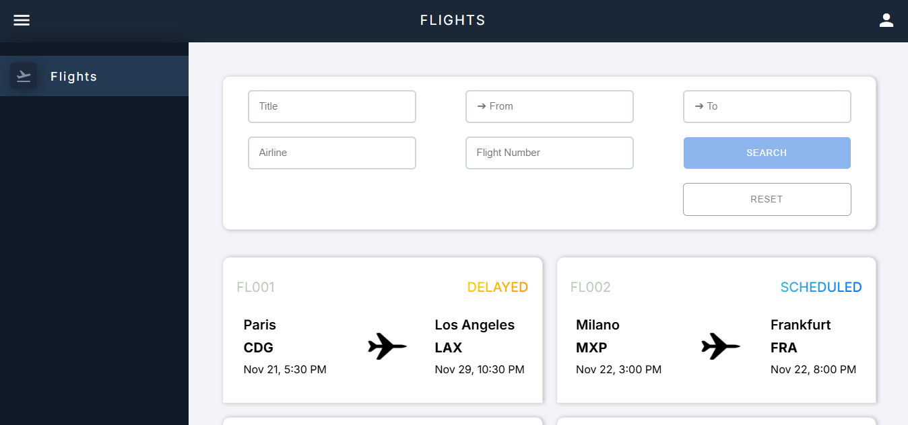
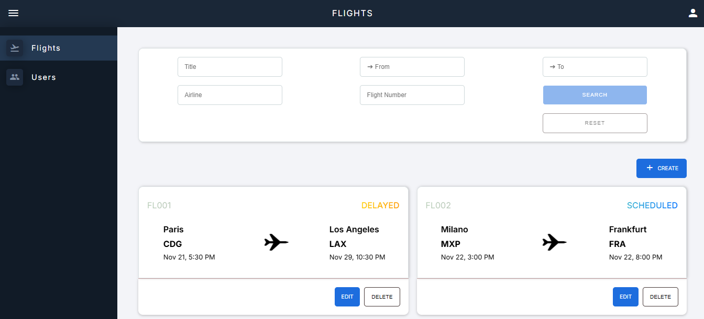
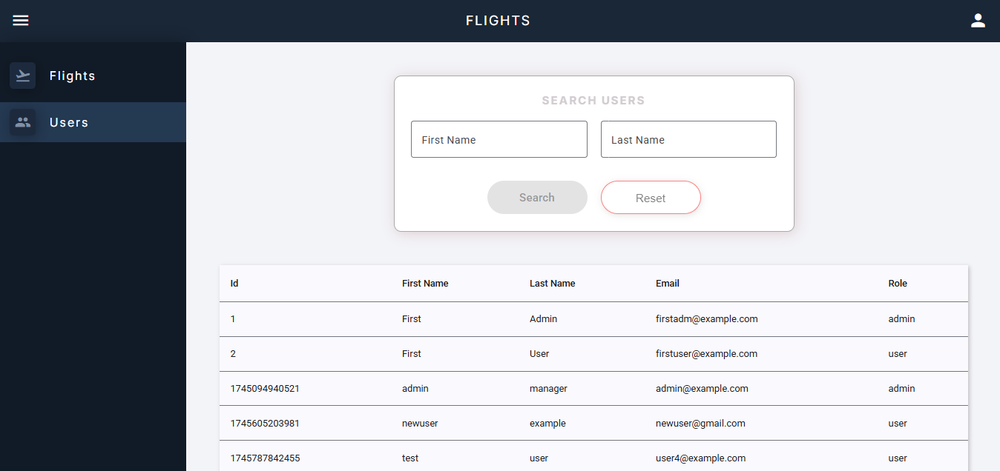

# Flights Angular

A modern **Flights Management Application** built with **Angular**, **Node.js (Express.js)**, and a **JSON Server** backend.  
This project provides role-based access for **Admins** and **Users**. Users can view and filter flights. Admins have additional privileges, including creating, editing, and deleting flights (CRUD operations) and managing users, such as viewing the list of registered users in the application.

## Features

### Admin Role

- Create, edit, and delete flight records.
- View all registered users in a dynamic **Angular Material Table**.
- Intuitive and secure admin dashboard interface.

### User Role

- Browse available flights with rich filtering options:
  - Flight Title
  - Destination Country
  - Arrival Country
  - Airline
  - Flight Number
- Responsive pagination for a smooth browsing experience.
- Clean and user-friendly UI built with **Angular Material**.

## Others

- **Window Communication**: Actions on one window reflect on another window on authentication part.

## Technical Highlights

- **NgRx Signal Store:** Used for managing users for a **reactive**, **fast**, and modern state management experience.
- **Component Store:** Used for managing flights with **localized component-level** state.
- **BehaviorSubject / Native Store:** Used for **authentication** state management.
- **Role-Based Guards:** Implemented **route guards** to restrict access based on Admin or User roles.
- **Authentication Handling:** Used **HTTP interceptors** to attach Bearer tokens for **secured** API requests.
- **Reactive Forms & Validation:** Integrated forms with **custom validators** for flights (date validation).
- **Angular Material UI:** Utilized **tables**, **pagination**, and filtering for a **modern** and **user-friendly** interface.

## Requirements

- Angular CLI (v19.0.1)
- Node.js (v22 or above)
- npm (v9 or above)
- json-server (0.17.0)

## Setup

1. **Clone the repository**:

```
git clone https://github.com/matrakugeri/flights-angular.git
cd flights-angular
```

2. **Install Dependencies**:

```
npm install
cd json-server && npm install
```

## Running the Application

### Angular Development Server

1. **Start Angular Development Server**:

```
ng serve
```

2. Open your browser and navigate to `http://localhost:4200/`.

### JSON Server

1. **Start JSON Server**:

```
cd json-server && npm start
```

The JSON Server will be running on `http://localhost:3333`.

## Screenshots

### Signup & Login

  
  

### User Main View



### Admin Main View



### CRUD OPERATIONS


### Users Table


